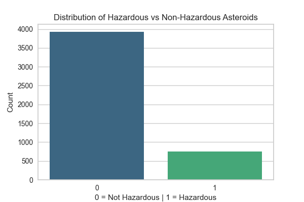
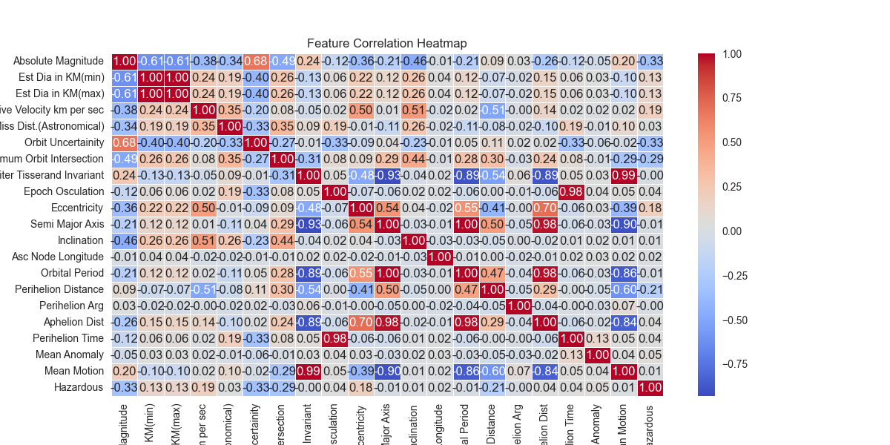

# 🚀 **Hazardous Asteroid Prediction**
A machine learning pipeline to predict potentially hazardous asteroids using NASA's **Near Earth Object Web Service (NeoWs)** dataset.  
This project applies **data preprocessing, feature engineering, synthetic data balancing (SMOTE), and machine learning model training** using PyCaret.

---

## **📌 Project Overview**
- **Preprocessing:** Cleans the dataset, removes unnecessary columns, and encodes categorical variables.
- **EDA:** Generates visual insights into asteroid characteristics.
- **Feature Engineering:** Applies **SMOTE** to balance class distribution and scales features.
- **Model Training:** Compares multiple models using **PyCaret** and selects the best one.
- **Evaluation:** Stores model performance metrics for analysis.

---

## **📌 Data Pipeline**
### **1️⃣ Preprocessing**
- Removes redundant features (e.g., duplicate distance measurements).
- Converts categorical values (e.g., `"Hazardous" → 1/0`).
- Saves cleaned dataset.

### **2️⃣ Exploratory Data Analysis (EDA)**
- Class distribution plot:
  
- Feature correlation heatmap:
  

### **3️⃣ Feature Engineering**
- Encodes categorical variables (`Orbiting Body`).
- Applies **SMOTE** to balance hazardous vs. non-hazardous asteroids.
- Scales numerical features.

### **4️⃣ Model Training & Evaluation**
- Trains **Decision Tree, Random Forest, AdaBoost**, and more.
- Uses **PyCaret** to compare models automatically.
- Saves model performance metrics.

| Model          | Accuracy | Precision | Recall | F1-Score |
|---------------|----------|-----------|--------|----------|
| **Best Model** | 🚀 **_Auto-selected by PyCaret_** 🚀 |

🔹 **Full performance table saved in**: [`reports/model_performance.csv`](reports/model_performance.csv)

---

## **📌 How to Run the Project**
### **1️⃣ Install Dependencies**
Ensure you have all required libraries installed:
```bash
pip install -r requirements.txt
